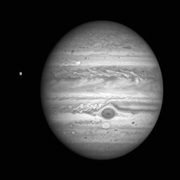
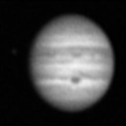

# Astronomical Image Super-Resolution with Weighted Loss Functions

This repository contains the code for my undergraduate thesis project:  
"Weighted Loss Function Design for Super-Resolution in Astronomical Imaging".  
The project is based on and extends Julia Netzel, ETH Zürich, Department of Mathematics, 2023.  

## Project Overview

We build upon the SRCNN super-resolution framework and investigate the effectiveness of weighted loss functions, specifically weighted MSE and weighted MAE, to enhance the restoration of central fine structures in astronomical images. We also compare with the Richardson–Lucy deconvolution algorithm. This README highlights selected results and provides a one-command demo to reproduce SRCNN on a small sample.

The project includes:  
- Synthetic datasets with different PSF and noise levels  
- Baseline and modified SRCNN implementations  
- Custom loss functions (Weighted MSE, Weighted MAE)  
- Evaluation metrics: PSNR, SSIM, Selective SSIM (SSSIM)  

A paper in Chinese version is attached.  

## Implementation Highlights

- Implemented SRCNN in PyTorch for astronomical image super-resolution  
- Designed and tested center-weighted MSE and MAE loss functions  
- Benchmarked against the Richardson–Lucy classical deconvolution algorithm  
- Evaluated performance using PSNR, SSIM, and SSSIM  
- Demonstrated improvements in detail consistency when using weighted losses  

## Quick Demo

The repository provides a small demo dataset (ten FITS images).  
You can reproduce the SRCNN results directly by running the shell script:

```bash
git clone https://github.com/CheeseLee888/AstronomyImageSR.git
cd AstronomyImageSR
pip install -r requirements.txt
# install PyTorch separately (CPU example)
pip install torch torchvision --index-url https://download.pytorch.org/whl/cpu
bash run_srcnn.sh
```

This script will:
- Generate the required CSV files (`create_csv.py`).
- Run the SRCNN training/evaluation (`srcnn.py`).
- Execute the analysis notebook and save the results of data and plots locally.

Note: Many training parameters (epochs, batch size, learning rate, loss type) are directly defined in the code files (e.g., `SRCNN/srcnn.py`). 
For this demo, no additional arguments are required — the script runs end-to-end with the default settings.

## Thesis Dataset

The full experimental datasets (COSMOS NICMOS HST) used in the thesis are available at:  
[https://irsa.ipac.caltech.edu/data/COSMOS/images/nicmos/](https://irsa.ipac.caltech.edu/data/COSMOS/images/nicmos/)

Note: This repository already includes a small demo dataset (ten FITS images under data_demo/), so you don’t need to download the full dataset to run the demo.
## Representative Thesis Results

We include selected results from the full thesis experiments.  

### Example Images (Training results on Jupiter images)

| HR Image | LR Image | RL Reconstruction | SRCNN (MSE) Reconstruction |
|----------|----------|-------------------|----------------------------|
|  |  |  |  |

The Richardson–Lucy reconstructions tend to produce sharper but noisier results, while the SRCNN outputs are smoother with reduced noise.


### Quantitative Metrics (Dataset 4.001)

| Loss Function    | SSIM Mean | SSIM SD | SSSIM Mean | SSSIM SD |
|------------------|-----------|---------|------------|----------|
| MSE              | 0.983     | 0.027   | 0.791      | 0.230    |
| Weighted MSE α=2 | 0.985     | 0.027   | 0.792      | 0.230    |
| Weighted MSE α=4 | 0.986     | 0.027   | 0.797      | 0.224    |

Weighted MSE consistently improves SSSIM, showing better preservation of fine structures compared to non-weighted losses. 
